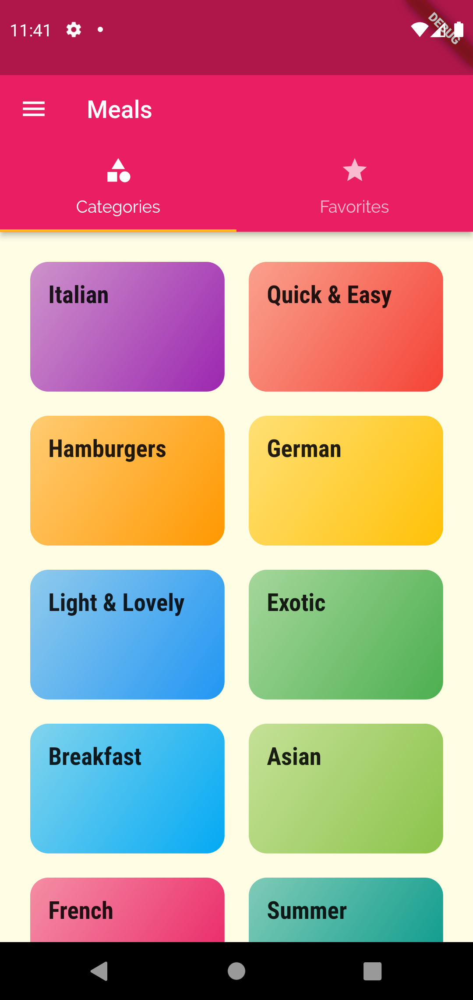
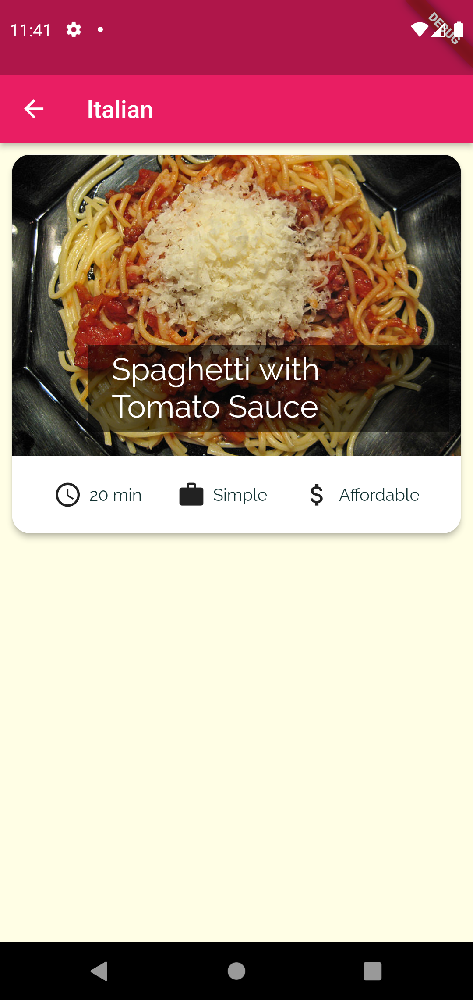
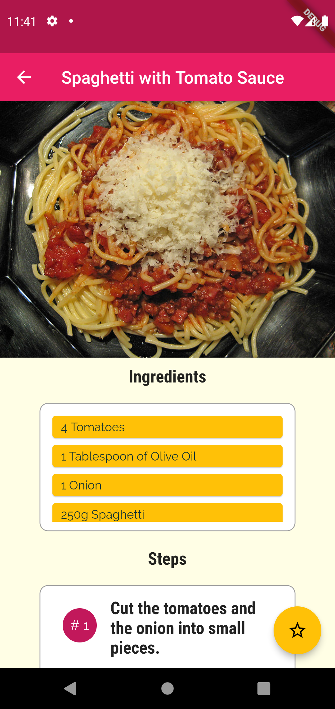
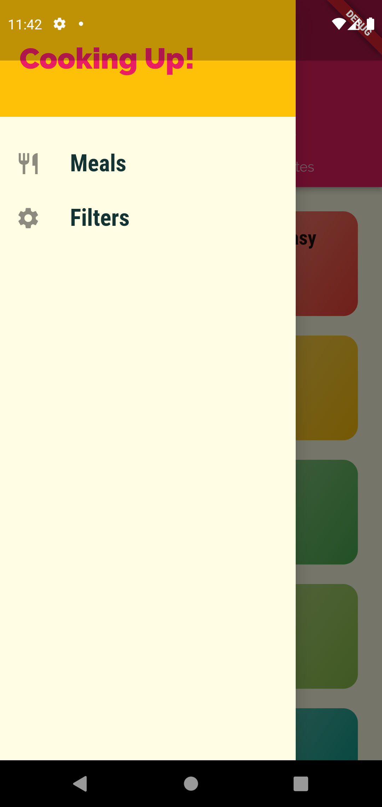
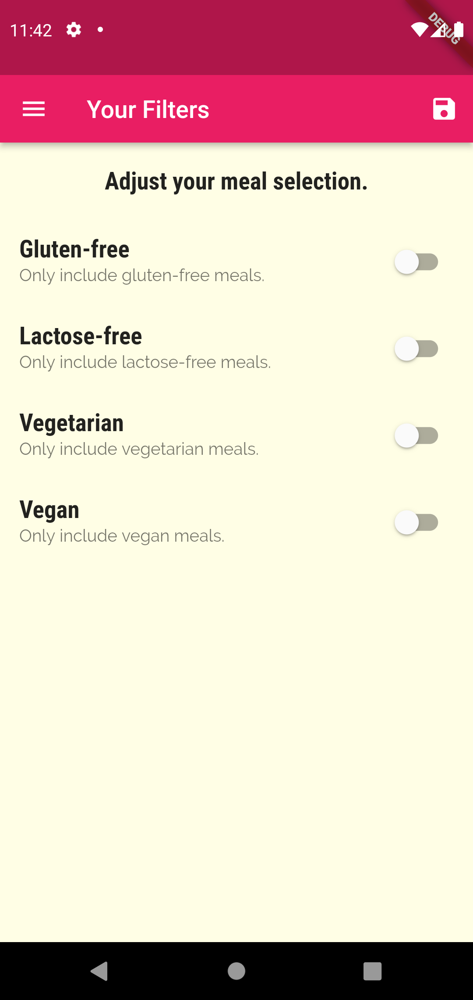
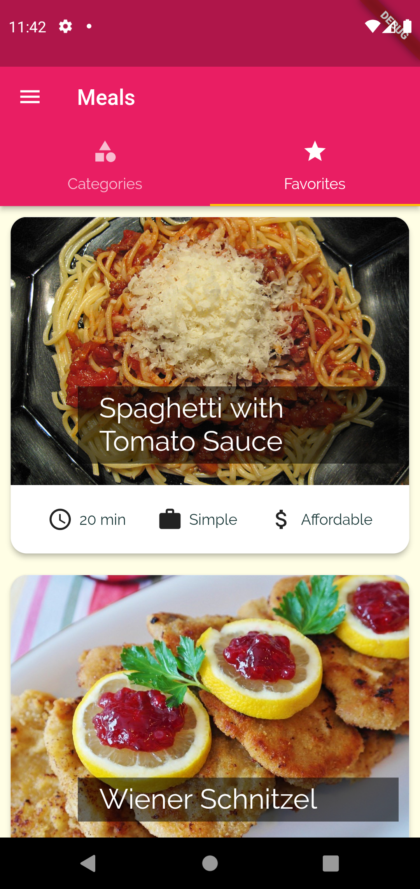

# FoodApp

## I learnt this following thing from this project

- How to use TapBar widget.
- How to add Bottom Navigation Bar.
- How to add a Custom Drawer.
- How to use InkWell and ClipRRect widgets.

## Output

 

 

 

 

 

